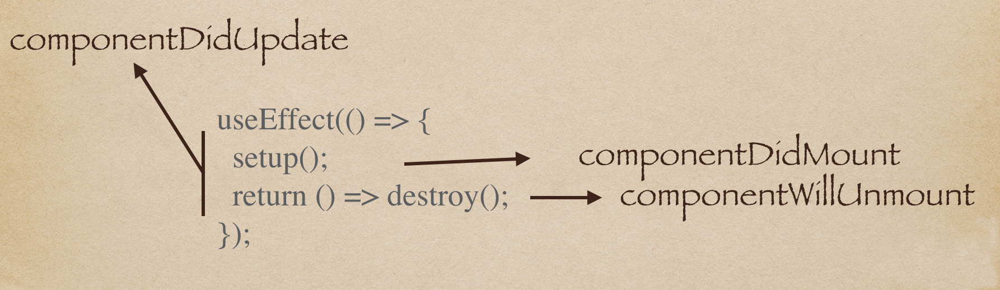

# Hook

[Hook](https://zh-hans.reactjs.org/docs/hooks-intro.html) 是 `React 16.8` 的新增特性，它可以让你在不编写 `class` 的情况下使用 `state` 以及其他的 `React` 特性

## 1. Hook 简介

### 1.1 Hook 使用规则

[规则](https://zh-hans.reactjs.org/docs/hooks-rules.html)

- 只能在 `React 函数组件` 中调用，可在 [自定义 Hook]() 中调用其他 `Hook`
- 不能在循环、条件、或嵌套函数中调用 `Hook`
  - 即只能在一个函数组件中最外层调用

## 2. 基础 Hook

### 2.1 useState

> 用来 **初始化** ，和 **修改状态** 的钩子

```ts
const [state, setState] = useState(initialState);

setState(newState);
```

- `initialState：` 首次渲染使用的值，当初始值较为复杂时，可传函数形式
- `state：` 初始变量
- `setState：` 后续修改变量，即 `state` 的方法

<Alert type="info">和 `class 组件` 不同，若更新的数据 **与上次相同**，则 `React` 将自动跳过子组件的渲染，及 `effect` 的执行</Alert>

### 2.2 useContext

> 用来跨组件，**获取上下文** 的钩子
>
> 1. [React 哲学](https://zh-hans.reactjs.org/docs/thinking-in-react.html) 需要自顶向下设计，因此就包括自上而下的数据流（_传参_）
> 2. 仅需在顶层组件注入（创建上下文），就可在任意一级的子组件中，获取顶层组件注入的上下文
> 3. 无需通过中间组件 `props` 的形式，一级级往下传参

接收一个 `context` 对象，并返回该 `context` 的当前值，实现跨级组件之间的数据通信

```ts
const MyContext = React.createContext(value);
const value = useContext(MyContext);
```

- `React.createContext：` 创建上下文
- `useContext()：` 任意子组件中获取上下文

示例如下：

```ts
const themes = {
  light: {
    foreground: '#000000',
    background: '#eeeeee',
  },
  dark: {
    foreground: '#ffffff',
    background: '#222222',
  },
};

// 创建上下文
const ThemeContext = React.createContext(themes.light);

// 父组件
function App() {
  return (
    <ThemeContext.Provider value={themes.dark}>
      <Toolbar />
    </ThemeContext.Provider>
  );
}

// 中间组件
function Toolbar(props) {
  return (
    <div>
      <ThemedButton />
    </div>
  );
}

// 子组件
function ThemedButton() {
  const theme = useContext(ThemeContext);
  return (
    <button style={{ background: theme.background, color: theme.foreground }}>
      I am styled by theme context!
    </button>
  );
}
```

### 2.3 useEffect

> **渲染后** 执行某些操作（_副作用_）的钩子
>
> 1. 每次渲染之后执行
> 2. 可以看做是 `componentDidMount`，`componentDidUpdate` 和 `componentWillUnmount` 这三个生命周期函数的组合
> 3. 它会在调用一个 `next effect` 之前，对 `last effect` 进行清理

示例如下：

- class 组件生命周期

  ```ts
  componentDidMount() {
      ChatAPI.subscribeToFriendStatus(
        this.props.friend.id,
        this.handleStatusChange
      );
    }
    componentDidUpdate(prevProps) {
      // 取消订阅之前的 friend.id
      ChatAPI.unsubscribeFromFriendStatus(
        prevProps.friend.id,
        this.handleStatusChange
      );
      // 订阅新的 friend.id
      ChatAPI.subscribeToFriendStatus(
        this.props.friend.id,
        this.handleStatusChange
      );
    }
    componentWillUnmount() {
      ChatAPI.unsubscribeFromFriendStatus(
        this.props.friend.id,
        this.handleStatusChange
      );
    }
  ```

- 函数组件 **hook** 写法

  ```ts
  function FriendStatus(props) {
    // ...
    useEffect(() => {
      // ...
      ChatAPI.subscribeToFriendStatus(props.friend.id, handleStatusChange);
      // 如同componentDidMount，componentDidUpdate里执行新的副作用函数
      return () => {
        ChatAPI.unsubscribeFromFriendStatus(props.friend.id, handleStatusChange);
        // 如同componentWillUnmount，componentDidUpdate里对已执行的副作用函数的清理函数
      };
    });
  ```

- 执行顺序

  ```ts
  // Mount with { friend: { id: 100 } } props
  ChatAPI.subscribeToFriendStatus(100, handleStatusChange); // 运行第一个 effect

  // Update with { friend: { id: 200 } } props
  ChatAPI.unsubscribeFromFriendStatus(100, handleStatusChange); // 清除上一个 effect
  ChatAPI.subscribeToFriendStatus(200, handleStatusChange); // 运行下一个 effect

  // Update with { friend: { id: 300 } } props
  ChatAPI.unsubscribeFromFriendStatus(200, handleStatusChange); // 清除上一个 effect
  ChatAPI.subscribeToFriendStatus(300, handleStatusChange); // 运行下一个 effect

  // Unmount
  ChatAPI.unsubscribeFromFriendStatus(300, handleStatusChange); // 清除最后一个 effect
  ```

所以不论是首次挂载后的 `render`，还是触发更新导致的 `render`，均会执行 `useEffect`



重新 `render` 会执行 `new useEffect`， 执行 `new useEffect` 前，会执行 `old useEffect` 的 `return()`，若需要用到 `state`，此时拿到的是旧的 `state`

##### 性能优化

> 此时你会发现，只要组件触发渲染，就会使 `useEffect` 频繁触发，那么有没有办法，可以让 `useEffect` "按需" 触发

```
useEffect(func, [deps])
```

- `func：` 每次更新后需要改变的副作用函数

- `[deps]：` 可选参数，限制变化参数

  - 这个参数是个 `array`，依赖项的意思，相当于 `computed` 的作用，它会仅在这个参数变化时，才会去执行这个 `hook` ，从而避免依赖渲染

  - 相当于 `class` 组件 `componentDidUpdate()` 中添加了比较判断

    ```ts
    componentDidUpdate(prevProps, prevState) {
    	if (prevState.xx != this.state.xx) {
    		// 触发 effect
    	}
    }
    ```

  - 若不使用第二个参数，则每次 `rerender` 均会执行

  - 若仅需该 `hook` 执行一次，只传个 `[]` 即可

## 3. 额外 Hook

### 3.1 useReducer

> 即自定义 `useState` 执行了比较复杂的更新（封装），用于替代 `redux`

```ts
const [state, dispatch] = useReducer(reducer, initialArg, init);
```

- `reducer：` 需要执行的函数
- `initialArg：` `state` 的初始值
- `init：` 第一次执行时，对初始值的更新
- `dispatch：` 用于执行 `reducer` 中的回调函数

示例如下：

```ts
import React, { useReducer } from 'react';

const reducer = (state, action) => {
  switch (action.type) {
    case 'Add':
      return { count: state.count + 1 };
    case 'Sub':
      return { count: state.count - 1 };
    case 'Reset':
      return { count: action.payload };
    default:
      return state;
  }
};

const initfnc = (initCountState) => {
  return { count: initCountState + 1 };
};

export default function UseReducerPage(props) {
  const [state, dispatch] = useReducer(reducer, props.initCount, initfnc);
  return (
    <div>
      <h3>UseReducerPage</h3>
      <p>{state.count}</p>
      <button onClick={() => dispatch({ type: 'Add' })}> + </button>
      <button onClick={() => dispatch({ type: 'Sub' })}> - </button>
      <button
        onClick={() => dispatch({ type: 'Reset', payload: props.initCount })}
      >
        {' '}
        reset{' '}
      </button>
    </div>
  );
}
```

### 3.2 useMemo、useCallback

> 常用于性能优化，减少计算消耗，为了仅在某个依赖项改变时才重新计算 `memoized` 值

**memoize**：常见函数，如 `lodash` 或者 `rambda` 中都有，像闭包缓存，用空间换时间

```ts
// useMemo(func, deps)
const memoizedValue = useMemo(() => computeExpensiveValue(a, b), [a, b]);

// useCallback(func, deps)
const memoizedCallback = useCallback(() => {
  doSomething(a, b);
}, [a, b]);
```

- `func：` 创建的函数，即闭包 `memoized`

  - `memo：` 函数组件中创建的内部函数，避免非依赖项的修改，而引发函数执行
  - `callback：` 通过父组件传递过来的回调，避免非依赖项的修改，而引发回调执行

- `deps：` 同上 `Effect`，需要减少计算的目标依赖项

示例如下：

- ##### **useMemo**

  ```ts
  const UseMemoPage = (props) => {
    const [count, setCount] = useState(0);

    const expensive = useMemo(() => {
      let sum = 0;
      for (let i = 1; i < count; i++) {
        console.log('i', i);
        sum += i;
      }
      return sum;
    }, [count]);

    const [value, setValue] = useState('');

    return (
      <div>
        {count}
        <br />
        {expensive}
        <br />
        <button onClick={() => setCount(count + 1)}>add</button>
        <input
          value={value}
          onChange={(event) => setValue(event.target.value)}
        ></input>
      </div>
    );
  };
  ```

  - 返回的是结果值，页面可直接调用

- ##### **useCallback**

  ```ts
  const UseCallbackPage = (props) => {
    const [count, setCount] = useState(0);

    const addClick = useCallback(() => {
      let sum = 0;
      for (let i = 1; i < count; i++) {
        console.log('i', i);
        sum += i;
      }
      return sum;
    }, [count]);

    const [value, setValue] = useState('');
    return (
      <div>
        <h3>UseCallbackPage</h3>
        <p>count: {count}</p>
        <button onClick={() => setCount(count + 1)}>add</button>
        <input
          value={value}
          onChange={(event) => setValue(event.target.value)}
        />
        <Child addClick={addClick} />
      </div>
    );
  };

  const Child = React.memo((props) => {
    const addClick = props.addClick;

    console.log('Child render');
    return (
      <div>
        <button onClick={() => console.log(addClick())}>add</button>
      </div>
    );
  });
  ```

  - 通常配合 **React.memo** 来性能优化，这个是针对函数组件式的浅层比较，类似 `class` 组件的`PureComponent`。但对于深层 `state` 比较，是不奏效的
  - 还经常和 [useRef]() 搭配来提高性能，见下文

### 3.3 useRef
