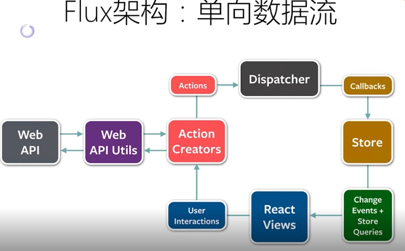
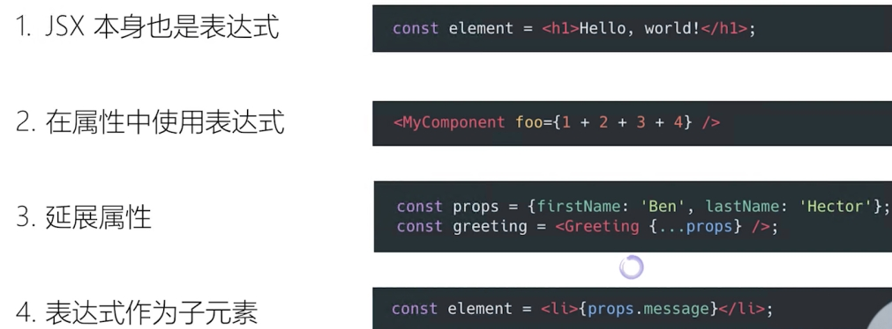
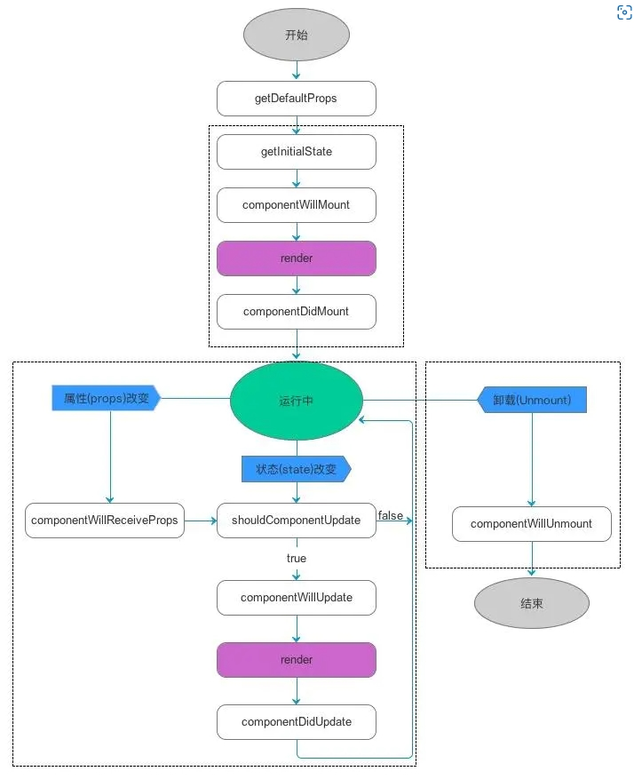

# React 框架

[React 中文文档](https://zh-hans.reactjs.org/)

### 1. React 简介

#### 1.1 历史背景：

**React** 是当时 `facebook` 为了解决如下问题：

- 传统 `UI` 操作关注大量细节 （**JQ** 需要熟悉各种 `API` 才能操纵 `DOM`）
- 应用程序状态分散在各处，难以维护，随着项目不断复杂化，导致改个小需求，`bug` 频发

### 1.2 特性：

> **React** 其实很简单，特性如下：

##### **整体刷新页面**：

- 如: `append` 一个消息，`DOM` 上增加一个 `<li>message</li>`
  - 原生做法，需要修改时操作父级 `DOM`，判断子 `DOM` 是否增加，和增加到了那里
  - 使用`React`，只用关心整体状态，之前是 2 条消息 -> 后面是 3 条消息 整体改变状态即可
- **好处**：不用关心 `DOM` 细节

##### **组件概念**：

> 组件：将整个 `UI` 拆分成一块块组件，页面由多个组件搭积木，拼合而成

属性 + 状态 -> 得到一个 `View`

<Badge type="success">props</Badge> + <Badge type="error">state</Badge> -> <Badge> View</Badge>

- 状态分为两种：

  - 传入的（通过 `props` 传进来）
  - 内部维护的（内部发生事件，让外部知道变化）

- 组件一般不提供方法，而是某种状态机*（状态是什么，结果就是什么）*
- 可理解为纯函数：输入的是什么，那么输出的结果一定是什么
- 单向数据绑定

- 单一职责原则：
  - 一个组件只干一件事
  - 若组件复杂，则拆分
    - 大组件，一个变化，整体组件都要刷新，若拆分成小组件，则只需小组件内部刷新

##### **单向数据流**：

> 传统 `MVC` 是一个 `Controller` 绑定了大量的 `Model`，而且每个 `Model` 还绑定了各种 `View`


这种架构导致特别混乱，维护异常困难，因此 `React` 提出了如下 **Flux 架构：**



**React** 只关注于状态，如图：是 **Flux 架构** ，一种 **设计模式**，但非完整实现

- `View` 上发生了操作
- `->` 产生 `Action`
- `->` 通过 `Dispatcher` 出去
- `->` 由 `Store` 进行处理，改变数据
- 由于 `View` 绑定在 `Store` 上，因此会随之改变数据

**数据状态管理原则**：_（**DRY**）_

- 能计算得到的状态，就不要单独存储
- 组件尽量无状态，所需数据通过 `props` 获取

##### **4 个必须 API**：

##### **完善的错误提示**：

### 1.3 JSX：

**JSX 表达式**

> `JSX` 的本质，其实不是模板语言，而是语法糖，一个 `JSX` 表达式，就相当于一个 `createElement` 组件



### 1.3 安装：

**安装：**

```shell
$ npm install -g create-react-app
$ create-react-app my-app
$ cd my-app
$ npm start
```

### 2. React 生命周期：

#### 2.1 React v16 前

> **注**：函数组件没有调用如下生命周期方法的能力


##### **2.2.1 初始化 - Initialization**

```ts
import React, { Component } from 'react';

class Test extends Component {
  // 继承了React.Compoent 才获得生命周期和对应能力
  constructor(props) {
    super(props);
  }
}
```

- `constructor()`：构造方法，初始化工作

  > 只要使用了`constructor()` 就必须写 `super()`，否则 **会导致 this 指向错误**

- `super(props)`：调用基类的构造方法，同时将父组件的 `props` 注入子组件

**2.2.2 挂载 - Mounting**

- `componentWillMount`：组件挂载到 `DOM` 前，只调用一次，此时调用 `this.setState` 不会触发 `render`，较少使用（若 `setState` 比 `render` 慢，则会白屏，需要加 `loading` 提高用户体验）
- `render`：比较 `props` 和 `state`，返回一个 `react` 元素。不负责实际渲染工作，由 `React` 自身渲染出页面 `DOM`。纯函数，不能再其中执行 `this.setState`
- `componentDidMount`：挂载后调用，此时 `DOM` 节点已生成，仅一次。可调用 `ajax` 请求，返回数据后组件会重新渲染

**2.2.3 更新 - Update**

**造成组件更新的有两类（三种）情况**：

1. 父组件重新 `render`

   - 每当父组件重新 `render` ，都会重传 `props` ，导致子组件重新渲染

   - 在 `componentWillReceiveProps` 方法中，将 `props` 转换成自己的 `state`

     ```ts
     class Child extends Component {
       constructor(props) {
         super(props);
         this.state = {
           someThings: props.someThings,
         };
       }
       componentWillReceiveProps(nextProps) {
         // 父组件重传 props 时就会调用这个方法
         this.setState({ someThings: nextProps.someThings });
       }
       render() {
         return <div>{this.state.someThings}</div>;
       }
     }
     // 不会二次渲染指的是:
     // 每次子组件接收到新的props，都会重新渲染一次
     // 但可以在渲染前，通过 componentWillReceiveProps 将 state 更新，此时只渲染更新state的一次，不会再二次渲染props的那次，对性能有利
     ```

2. 组件本身调用了 `setState`，无论 `state` 有没有变化

   - 如上情况可通过 `shouldComponentUpdate` 优化：

     ```ts
     class Child extends Component {
       constructor(props) {
         super(props);
         this.state = {
           someThings: 1,
         };
       }
       // 使用这个方法，阻止渲染，否则 state 是否有变化都将会导致组件重新渲染
       shouldComponentUpdate(nextStates) {
         if (nextStates.someThings === this.state.someThings) {
           return false;
         }
       }

       handleClick = () => {
         // 虽然调用了setState ，但state并无变化
         const preSomeThings = this.state.someThings;
         this.setState({
           someThings: preSomeThings,
         });
       };

       render() {
         return <div onClick={this.handleClick}>{this.state.someThings}</div>;
       }
     }
     ```

- `componentWillReceiveProps(nextProps)`：只调用于 `props` 引起的组件更新过程中，响应 `props` 变化之后进行更新的唯一方式，参数 `nextProps` 是父组件传给当前组件的新 `props`，接受父组件改变后的 `props` 需要重新渲染组件时用到的比较多
- `shouldComponentUpdate(nextProps, nextState)`：比较 `nextProps`，`nextState` 及当前组件的`this.props`，`this.state`，返回 **true** 则继续执行更新过程，返回 **false** 则当前组件更新停止
  - 若存在该调用，则先判断是否有拦截，
  - 由于父组件重新渲染，会导致所有子组件更新，为防止子组件更新，可在子组件的该生命周期中限制
- `componentWillUpdate(nextProps, nextState)`：处理组件前更新的工作，很少使用
- `render`：上述同

  - 之后 `vdom` 会执行 [diff 算法]() ：给定两棵树，找最少转化步骤，按层 `diff`，不移动只删除

- `componentDidUpdate(prevProps, prevState)`：更新后调用，可以操作组件更新的 `DOM`，`prevProps` 和 `prevState` 参数指组件更新前的值

**2.2.3 卸载 - Unmounting**

- `componentWillUnmount`：在组件被卸载前调用，可以在这里执行一些清理工作，避免内存泄露，比如：

  - 清除定时器
  - 取消网络请求
  - 清内存
  - 清除 `componentDidMount` 手动创建的 `DOM` 元素等

整体流程图如下：



#### 2.2 Fiber

[Fiber 架构](/front_end/react生态/react/fiber)
