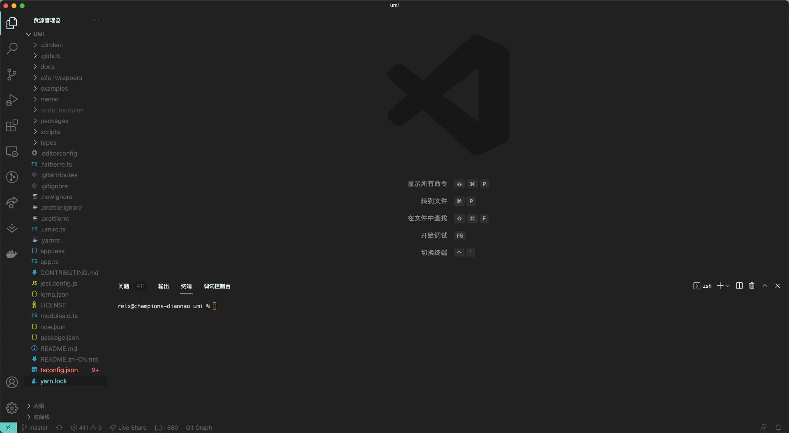

## umi 源码学习

因为工作原因开始使用 umi，作为一个需要不断学习的职业，当然需要认真的去学习并且研究研究人家优秀开源框架的实现原理，这里也作为一个笔记记录过程，学习如何使用以及实现原理用以提升自己 **（提升工资）**。

## 什么是 umi

umi 是蚂蚁开源的一个前端框架，是以路由为基础，同时支持配置式路由以及约定式路由，在保证路由功能完备的基础上进行功能拓展，并且配以生命周期完整的插件系统。

它主要具备以下功能：

- 🎉 可扩展，Umi 实现了完整的生命周期，并使其插件化，Umi 内部功能也全由插件完成。此外还支持插件和插件集，以满足功能和垂直域的分层需求。
- 📦 开箱即用，Umi 内置了路由、构建、部署、测试等，仅需一个依赖即可上手开发。并且还提供针对 React 的集成插件集，内涵丰富的功能，可满足日常 80% 的开发需求。
- 🐠 企业级，经蚂蚁内部 3000+ 项目以及阿里、优酷、网易、飞猪、口碑等公司项目的验证，值得信赖。
- 🚀 大量自研，包含微前端、组件打包、文档工具、请求库、hooks 库、数据流等，满足日常项目的周边需求。
- 🌴 完备路由，同时支持配置式路由和约定式路由，同时保持功能的完备性，比如动态路由、嵌套路由、权限路由等等。
- 🚄 面向未来，在满足需求的同时，我们也不会停止对新技术的探索。比如 dll 提速、modern mode、webpack@5、自动化 external、bundler less 等等。

以上都是官方文档复制的，就以这些核心点开始学习我们的源码吧。

## 下载项目

github、gitlab、gitee 上都有源码，直接搜索 umi 找到 `umijs/umi` clone 即可。

## 文件目录

clone 下来代码打开之后我们来观察整个项目的文件目录，主体大概是这样子的：


其中一些文件夹的作用如下：

```js
.circleci // 这里是使用来做代码持续部署的配置文件
docs // umi官网文档
packages // umi架构功能实现主体代码块
scripts // 一些命令文件
types // ts全局类型定义文件夹
```

而我们只需要研究这些核心功能的实现，所以需要关注的文件主要集中在 packages 里面，主要研究的是 packages/cores/src 文件夹下面的内容。

大概解释一下几个文件夹的主要内容：
|文件夹|作用|
|:----:|:----:|
|Config|配置类，用户与内核的连接|
|Route|约定时路由|
|Service|核心，提供整个内核的服务|

先从这几个文件夹实现原理开始研究。
