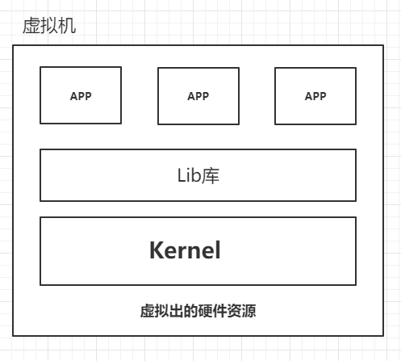
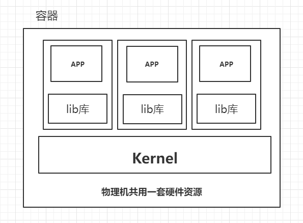

# Docker

<Alert type="info">

<p style="font-size: 16px; font-weight: 500; margin: 0">Tip:</p></br>
Docker 可以让开发者打包他们的应用以及依赖包到一个轻量级、可移植的容器中，然后发布到任何流行的 Linux 机器上，也可以实现虚拟化。
容器是完全使用沙箱机制，相互之间不会有任何接口（类似 iPhone 的 app）,更重要的是容器性能开销极低。
</Alert>

## 1 啥是 Docker：

- [Docker 官网](https://www.docker.com/)
- [Docker 官方文档](https://docs.docker.com/)
- [Docker Hub](https://hub.docker.com/)

### 1.1 教程

<iframe src="//player.bilibili.com/player.html?aid=838132893&bvid=BV1og4y1q7M4&cid=191591478&page=2" scrolling="no" border="0" frameborder="no" framespacing="0" allowfullscreen="true" style="width: 30%; height: 380px;"> </iframe>

- [Docker 教程 | 菜鸟教程](https://www.runoob.com/docker/docker-tutorial.html)
  - [Docker 安装 Redis | 菜鸟教程](https://www.runoob.com/docker/docker-install-redis.html)
- [Docker 教程 | w3cschool](https://www.w3cschool.cn/docker/)
- [Docker 从入门到实践 | w3cschool](https://www.w3cschool.cn/reqsgr/)

### 1.2 容器与虚拟机对比

虚拟机如 **VMware** 、**PVE** 多台虚拟机都要虚拟出了一套 **不同** 的 **硬件资源**、**Kernel**（内核）、**Lib 库**，然后在上层运行各自的 APP，像是物理机的系统中的子系统一样，从物理虚拟层面进行隔离，占用资源极高



而容器，则是多个容器 **共同使用** 一套物理机 **硬件资源**、**Kernel** 然后从运行所需的 **Lib 库** 层面 进行隔离，因此极大的压榨了物理资源，使物理机物尽其用。



## 2 安装

推荐参考官方文档：[安装 Docker 引擎（英文）](https://docs.docker.com/engine/install/)

### 2.1 CentOS

#### 卸载

- 执行如下命令，卸载软件包

  ```sh
  yum remove docker \
      docker-client \
      docker-client-latest \
      docker-common \
      docker-latest \
      docker-latest-logrotate \
      docker-logrotate \
      docker-engine
  ```

- 删除 `docker` 目录

  ```sh
  rm -rf /var/lib/docker/
  ```

#### 安装

###### 配置宿主机网卡转发

```sh
## 改系统配置，需要root执行，写如下系统配置到 `docker.conf` 中
cat <<EOF > /etc/sysctl.d/docker.conf
net.bridge.bridge-nf-call-ip6tables = 1
net.bridge.bridge-nf-call-iptables = 1
net.ipv4.ip_forward=1
EOF

## 加载配置使其生效
sysctl -p /etc/sysctl.d/docker.conf
```

- `net.ipv4.ip_forward = 1`: 比较重要控制机器间 **网卡流量的传递开关** 需要打开，否则一个机器多块网卡无法传递流量

##### yum 安装配置 docker

- 安装 `yum-utils` 包（提供 `yum-config-manager` 实用程序）

  ```sh
  yum install -y yum-utils
  ```

- 设置稳定的存储库（下载阿里源 repo 文件）

  ```sh
  ## 下载阿里源repo文件
  curl -o /etc/yum.repos.d/Centos-7.repo http://mirrors.aliyun.com/repo/Centos-7.repo
  curl -o /etc/yum.repos.d/docker-ce.repo http://mirrors.aliyun.com/docker-ce/linux/centos/docker-ce.repo

  ll /etc/yum.repos.d

  yum clean all && yum makecache
  ```

- 查看源中可用的版本

  ```sh
  yum list docker-ce --showduplicates | sort -r
  ```

- 安装 `docker-ce`

  - `ce` 为社区免费版， `ee` 为收费企业版

  ```powershell
  ## 会自动列出最新版依赖，否则需要手动指定各依赖版本
  yum install docker-ce -y
  ```

- 查看安装的 `docker` 软件

  ```sh
  yum list installed |grep docker
  ```

- 配置镜像源加速（可注册阿里云账号 - 容器获取）

  ```sh
  ## https://cr.console.aliyun.com/cn-hangzhou/instances/mirrors
  mkdir -p /etc/docker

  tee /etc/docker/daemon.json <<-'EOF'
  {
    "registry-mirrors": ["https://ubhu1j5h.mirror.aliyuncs.com"]
  }
  EOF

  ```

- 后续一系列配置

  ```sh
  ## reload & 开机自启
  systemctl daemon-reload
  systemctl enable docker
  systemctl restart docker

  ## 查看版本号和信息
  docker version
  docker info

  ## docker-client （就是一个 go 编写的 docker二进制文件）
  which docker

  ## docker daemon (查看 dockerd 守护进程)
  ps aux |grep dockerd

  ## containerd （独立服务，被dockerd拉起来的 独立进程）
  ps aux|grep conrainerd
  systemctl status containerd

  ## 查看docker系统日志
  journalctl -fu docker
  ```

### 2.2 Windows

推荐参考官方文档 [在 Windows 上安装 Docker Desktop（英文）](https://docs.docker.com/docker-for-windows/install/)

首先，确保满足先决条件：

- **- Windows 10 64 位 专业版、企业版、教育版**

  - 
    > - <Alert type="error">~~Igarashi：如果是家庭版建议重装系统~~ `→_→`</Alert>
    > - [在 Windows 10 家庭版上安装 Docker Hub（英文）](https://docs.docker.com/docker-for-windows/install-windows-home/)

- **已开启 Windows 虚拟化**

  - 

然后，[从官网下载 Docker Desktop 安装包](https://www.docker.com/products/docker-desktop)

安装时会自动打开 Windows 功能——虚拟机平台，如果勾选了
<abbr title="适用于 Linux 的 Windows 子系统">WSL</abbr>
可能会要求安装 [适用于 x64 计算机的 WSL2 Linux 内核更新包](https://docs.microsoft.com/zh-cn/windows/wsl/install-win10#step-4---download-the-linux-kernel-update-package)
下载安装后在 PowerShell 中使用以下指令将 WSL2 设为默认：

```ps
wsl --set-default-version 2
```

最后重启计算机即可。

**安装完成：**


## `Dockerfile`

::: tip
Dockerfile 是一个用来构建镜像的文本文件，文本内容包含了一条条构建镜像所需的指令和说明。

官方文档：
[`Dockerfile` 文档（英文）](https://docs.docker.com/engine/reference/builder/)
[`Dockerfile` 最佳实践（英文）](https://docs.docker.com/engine/userguide/eng-image/dockerfile_best-practices/)
:::

- [Dockerfile | 菜鸟教程](https://www.runoob.com/docker/docker-dockerfile.html)
- [Dockerfile 基本结构 | w3cschool](https://www.w3cschool.cn/reqsgr/redknozt.html)

- -
