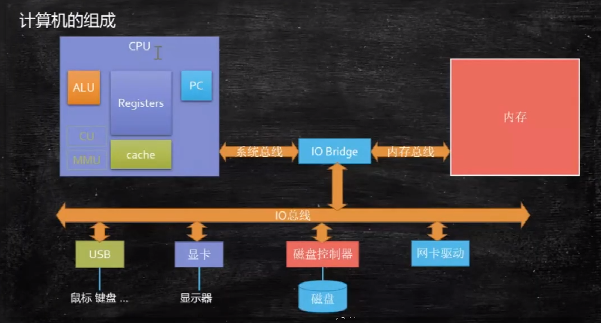

# 概述

### 1. 计算机硬件的五大单元

#### 1.1 组成部分

通常分为如下三个部分：

- **输入单元**：如 鼠标、键盘、数位板
- **主机部分**：系统单元，计算机壳子里面的，如 CPU、内存
- **输出单元**：如 屏幕、打印机

<Alert type="queen">因此计算机干的事：接收输入 -> 经过计算处理 -> 产生输出</Alert>

#### 1.2 五个单元：

由 `输入单元`、 `输出单元`、`CPU内部控制单元`、`算数逻辑单元` 与 `主内存` 这五个部分

**其内部构造如下图**：

详见：[硬件基础](/unix_like/硬件基础/cpu/cpu)
