# 解构 CPU 原理

<Alert type="miku">计算机世界中，万物起源于进制</Alert>

## 1. 编码与通信

<Alert type="error"> 渴望交流是人类最主要的天性之一，你能想到那些方式实现信息的交换？</Alert>

当你和朋友隔街而望，此时黑天没灯，没电话，更不会有电脑，谈话会被偷听，但你俩却各有一个手电筒。手电筒能用来交谈吗？你觉着可以一试，便想了以下方法：

- **方法一**：对于字母 **O** 你打算空气中画一个圈，然后关掉手电
- **方法二**：字母 **A** 手电筒闪一下，字母 **B** 两下.... **Z** 闪**26**下，字母间短停，单词长停
- **方法三**：字母 **A** 手电筒短闪一下，字母 **B** 长闪一下

> 此时你发现方法一太累，方法二要闪出一个 `How Are You` 要闪 **131** 次！而方法三通过长短闪的合理分配，闪 **32** 次即可

这样长短闪的组合，便是莫尔斯电码的前身，亦可用 **点(dot)** 和 **划(dash)** 来表示，或 **滴 (dib)**、**哒(dab)** 来表示，在实际应用中，每分钟可传递 **5~6** 个单词（说话大概是 100 词/min），这已经足够了

### 1.1 莫尔斯电码

莫尔斯码（Morse Code）是由塞缪尔 ● 莫尔斯发明的（1791~1872），伴随着电报机的问世而被发明的，通过它可方便的理解编码本质

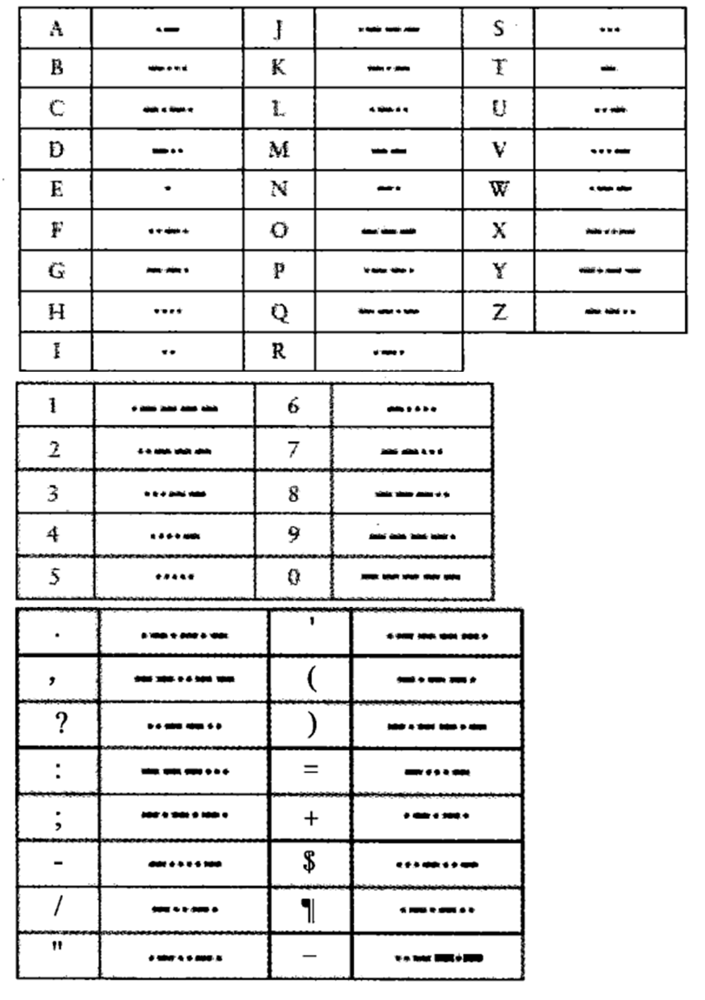

该电码的缺点是，没有区分大小写字母。同时，你会发现发送莫尔斯电码比接受编码并解码要省力的多，因为译者必须要通过 一堆点、划去反查字母，因此需要设计 **解码表** 来简化

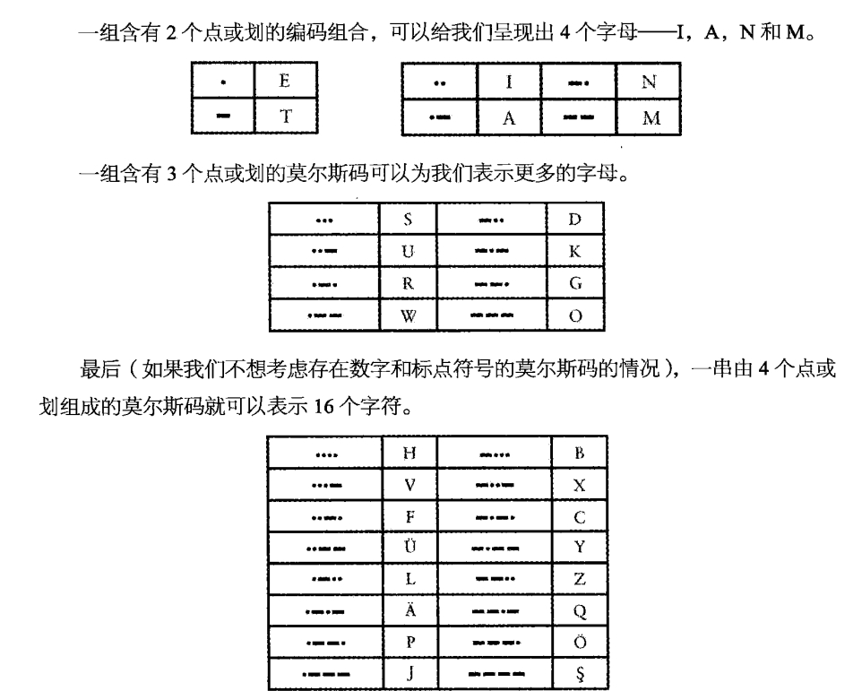

> 此时你会发现，这个解码表，是根据点和划的数量映射来决定的，包含了 2 + 4 + 8 + 16 组码，表示了 30 个字母，因此你会发现如下规律

| 点和划的数目 | 码字的数目 |   倍数关系    |
| :----------: | :--------: | :-----------: |
|      1       |     2      |       2       |
|      2       |     4      |     2 x 2     |
|      3       |     8      |   2 x 2 x 2   |
|      4       |     16     | 2 x 2 x 2 x 2 |

<Alert type="warning">每多一个点、划组合，就能多表示 **2 的次幂** 个码字的数目！**码字的数目 = 2 ^** <Badge>“点” 和 “划” 的数目</Badge></Alert>

因此，这和树形结构不谋而合，所以即可构造出一个 **莫尔斯解码树**，此时解码过程更是轻而易举，根据 **二叉树查找**，最多仅需 **4 次** 即可定位出**30 个字母中的任一个**

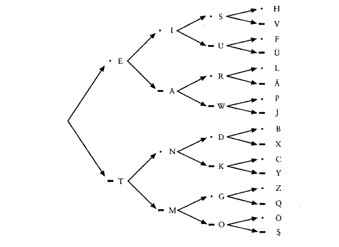

编码的组成元素只有 **点** 和 **划** 两个，这样的组合每次扩充都是使用 2 的乘方来描述，因此莫尔斯码也称为 **二进制码**

> 其实早在 1824 年，布莱叶就将书面语言的字母成功编码，即**布莱叶盲文**

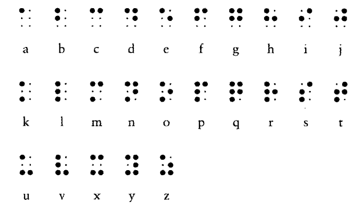

<Alert type="queen">比如现在使用的双拼映射，也和布莱叶盲文有异曲同工的原理，只不过更为简化易懂</Alert>

### 1.2 手电筒原理剖析

**手电筒组成**：一对电池、导线、灯泡、开关，研究手电前，先讨论一下 **电子理论**

- **原子**：由中子、质子、电子组成，中子和质子被束缚在原与子核内，而电子则环绕在原子核外旋转，

- **电流**：通常情况下，一个原子的原子核所含质子数和电子数相同，而某些情况下，电子会从原子中脱离，这就产生了电流

- **电荷**：质子和电子都具带有电荷性质，并且两者相异，因为我们使用 + 号代表质子具有正电荷，使用 - 号代表电子具有负电荷，但这仅仅是代表相异标识罢了
- **强力**：电荷相异则异性相吸，同性电荷相斥，原子核中的质子被一种力量束缚到一起，这种引力要强于同性电荷之间的斥力，因此称为强力，它则有可能引起原子核的分裂，**核能** 便是由此产生的

> 因此手电筒可以持续发光，不是电子简单的从一个点跳到另一个点，而是某些原子含有的电子逃逸到它相邻的下一个原子中，通过电子不断逃逸形成电流，这种化学反应一旦阴阳平衡，此时电量耗尽

- **导体**：不同材料（原子）的电子易失性不同，通常金、银、铜的易失性很强，电子十分容易逃逸，这种物质对于电流来说即是 **导通** 的，因此也称这些材料为导体
- **电阻**：与导电性相反，它则比起其他物质，更不容易让电流通过
- **绝缘体**：一种物质比如橡胶、塑料有非常强的阻抗，表示它几乎不能传导任何电流，因此称为绝缘体，但事实是（目前）没有不能被击穿的绝缘体，只要有足够高的电压，任何材料均能被击穿

- **电压**：由伏特（1745~1827）伯爵而得名，他与 1800 年发明出电池。电压则是电流做功的 **势** 即 **电势能** 的大小，和生活中的水压是一样的，阻力不变，压力越大，那么更多的水会流出，因此知道了电压和电阻，便可以知道电路中的电流大小 `I = E/R`

- **短路与断路**：当把电池的正负极和铜线连接，此时你会发现导线发热，这是由于这个电路系统中，电阻几乎为 0，电流则会异常的大，这种情况称为 **短路**，而发热则是由于电能，转化为了热能，若此时导线断了，那么正负极则通过空气相连接，此时电阻无限大，几乎不会有电流，因此称为**断路**，大部分电路都介于以上的两种情况
- **功率**：你会发现大量电器都会标有固定的 **瓦** 数，瓦则是瓦特（1736~1819）功率的计量单位，这就是刚才提到的电能、热能的物理表示，因此计算公式为：`P = E x I` 。它表示民用 240V 的电压下，功率越大，电能功耗越多，则越费电

### 1.3 手电筒的简易通信

由于以上 **电学** 知识和 **编码** 知识，此时你灵感突发，打算自制 "手电筒" 来制作一个电报系统：

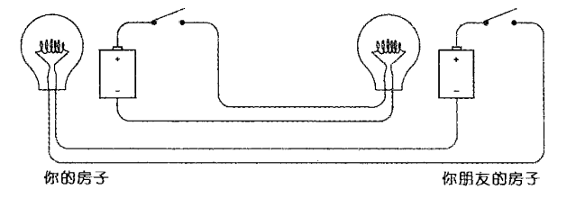

此时，你和你朋友可以通过各自控制开关，来给彼此同时分别发送消息，于是你为了节约导线，则进行了如下简化：

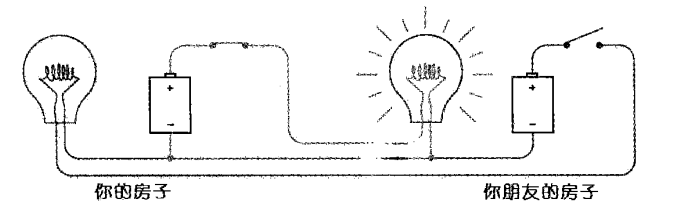

加入了公共导线，但觉着不够极致，于是突然想起，地球则是一个大绝缘体，但你想那是因为电压不过，你要把其当做一个导体。于是你整了个 10 米大铜柱当电极并砸进地里，此时简化为：

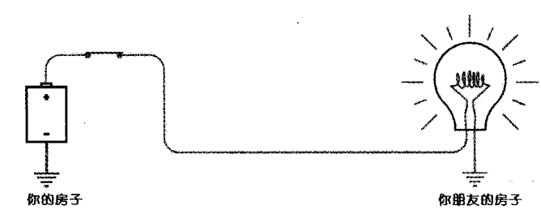

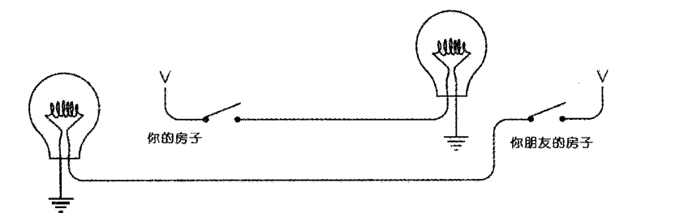

此时你发现，若要实现更长距离的通信，则终究会很快到大高电压的极限，于是这个难题的解决方案即现代的**计算机系统**

### 1.4 电报机与继电器

莫尔斯最为出名的不仅仅是电码，更是因为他发明了电报机，**电报**：即是远距离书写的意思。由于当时电灯泡还未被发明，他则是使用了 **电磁现象** （通电的铁具有磁力）来替代

**简易电报机**：通过 **电键**、**电磁铁**，线路构成

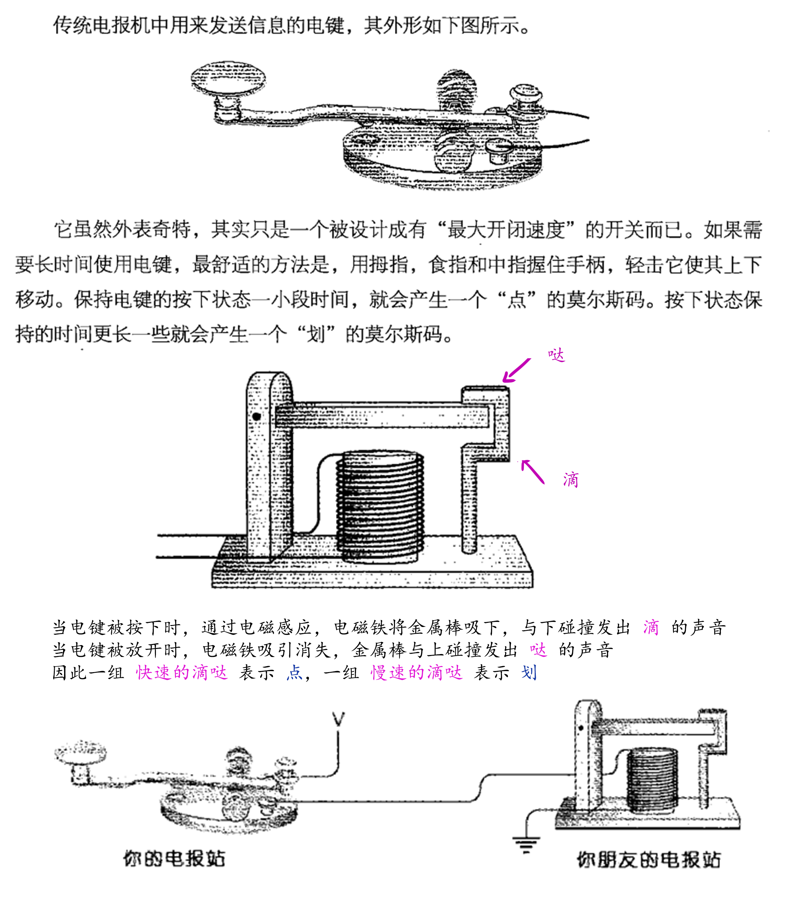

> 电报机的发明标志着现代通信的开始，虽然再后续的 **无线通信模式** 中抛弃了二进制，但后来的计算机等设备依然应用

尽管一些电报站使用了 **300V 高压**，但有效传输距离也就 **300 英里**，因此你需要设置一个 **中继系统** 来当做中转站，每隔 **200 英里**，便**配备一个工作人员、接受的发声器与电键**，但人力不如不要人力，于是你把发声器的用木棍、细绳和电键连接到了一起，每次电磁铁吸引都会带动发声器和电键，这就是 **电磁继电器** 的雏形，图示如下：

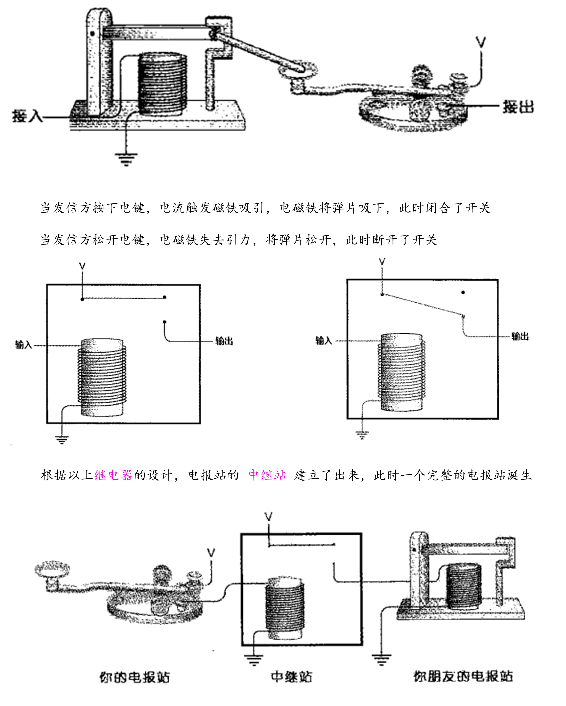

## 2. 进制与电路

**起源：** 莱布尼兹认为 1 与 0 是数字起源，用来造物，于是诞生出了二进制

> 即： 一切运算由最简单的 **0**、**1** 构成，逢 **2** 则进下一位
>
> 0000 0001 + 0000 00001 = 0000 0010

因此，用 **电信号** 来模拟表示，加上半导体、晶体管的发展，便诞生出了各种 **门电路**

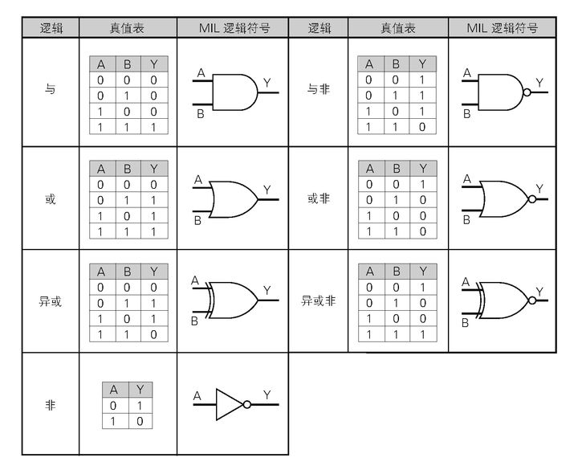

通过各种门电路的组合，于是诞生出了加法器

### 1.1 算术逻辑单元的由来

| 输入 1 | 输入 2 | 加和输出 | 进位输出 |
| :----: | :----: | :------: | :------: |
|   0    |   0    |    0     |    0     |
|   1    |   0    |    1     |    0     |
|   0    |   1    |    1     |    0     |
|   1    |   1    |    0     |    1     |

**输入 1** + **输入 2** + **加和输出** = <Badge type="error">异或门</Badge>

**输入 1** + **输入 2** + **进位输出** = <Badge>与门</Badge>

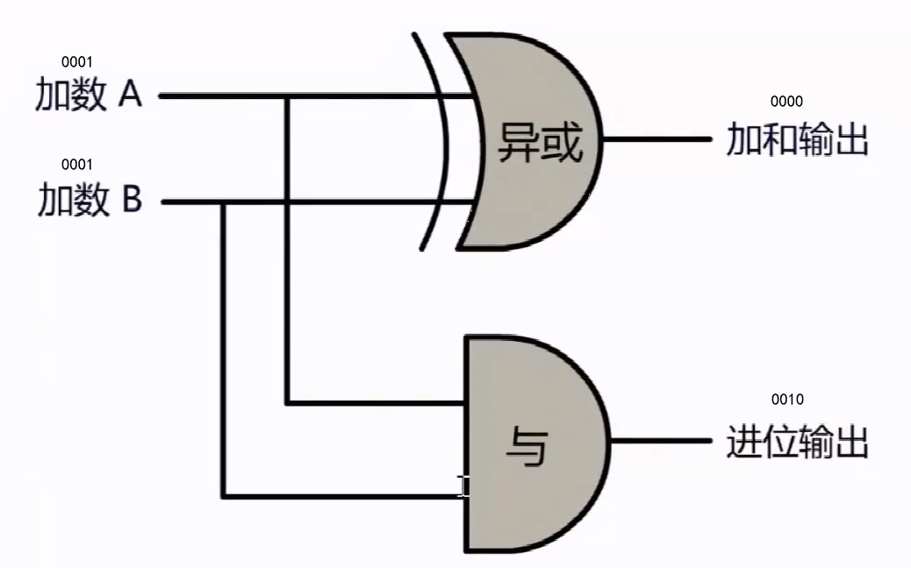

因此

<Badge type="error">异或门</Badge> + <Badge>与门</Badge> = <Badge type="orange">一位半加器</Badge>

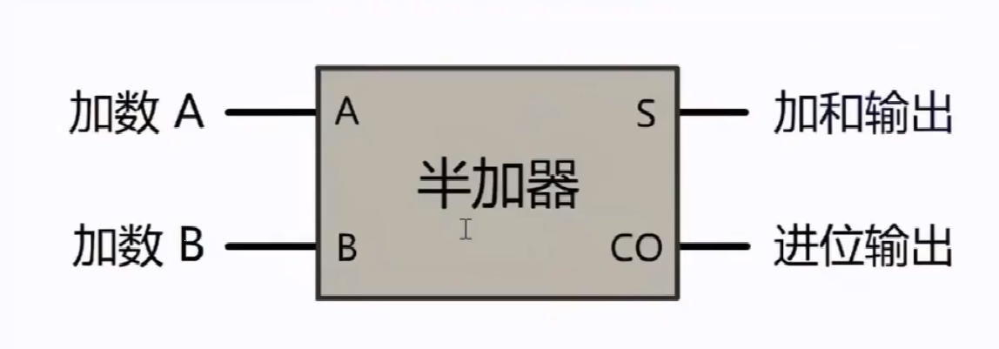

> - 此时，一个半加器能加、能进一，但却少了 **进位输入** 的考虑
> - 因此用第一个半加器的 **加和输出 S**，和下一个半加器的 **进位输入** 相加，得出新的 **加和输出** 和 **进位输出**
> - 在把两个半加器的 **进位输出 CO** 相或，实现了根据上次进位的输入，去进下位，从而变成**全加器**

<Badge type="orange">半加器</Badge> + <Badge type="orange">半加器</Badge> = <Badge type="queen">全加器</Badge>

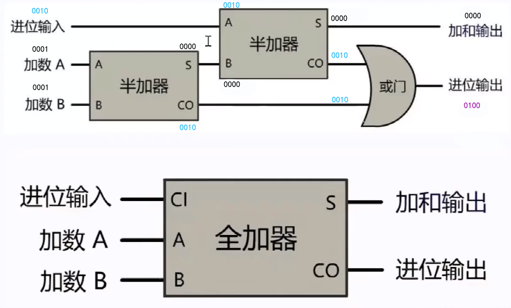

全加器能进一位，那么多（八）个全加器连续的串行，则变成**八位加法器**

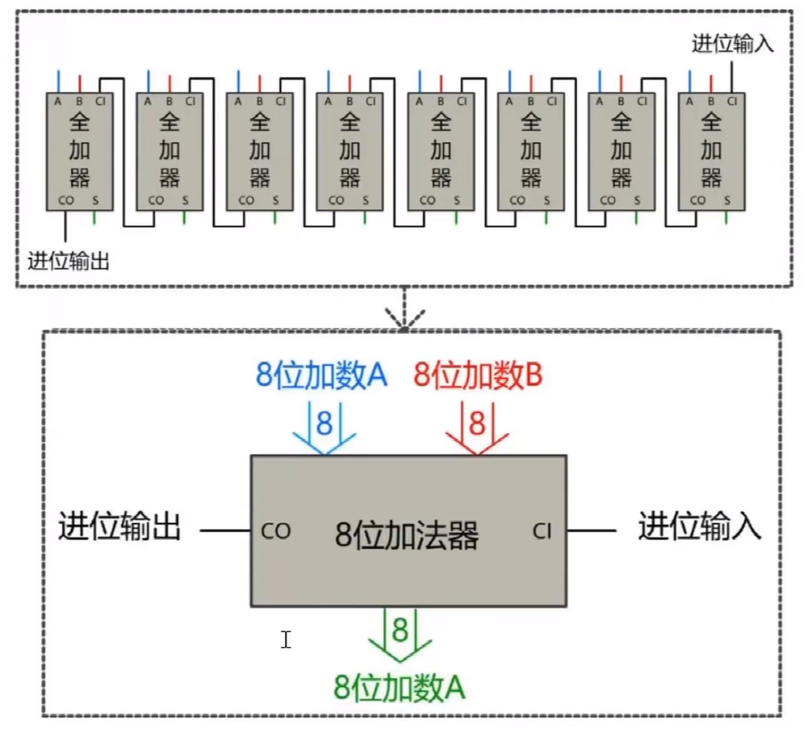

>

<Alert>因此 **32 位**、**64 位**....**N 位** 即是如此构成，这就是 **CPU** 最核心的 **ALU** 单元，算术逻辑单元 </Alert>

### 1.2 时钟的由来

除计算外，想要 CPU 具备计时功能，则需要时钟电路，如下：

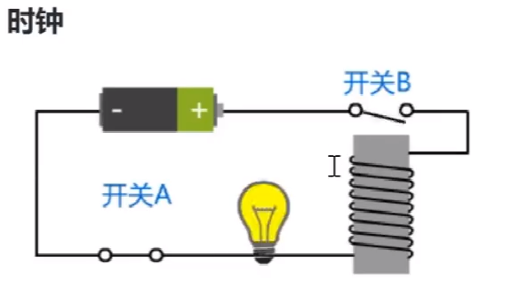

- 当闭合**开关 A** 时，电路导通

- 导通的电磁铁会产生磁力，把 **开关 B** 吸引下来，此时电路断开
- 电路断路，电磁铁失效，**开关 B** 又重新复位，电路再度连通。**开关 B** 又 ...
- 这就是 **振荡器**，以上步骤 **周而复始** 产生的有规律信号，即为 **时钟信号**

> 通常用来 **计时** 和产生 **周期性信号刺激**，CPU 的主频是多少，通常指的是每秒中开关多少次，若 1s 能开关 1w 次，则表示 CPU 在 1s 内可进行 1w 次计算

### 1.3 RAM

现在，有了[加法器](/soul/计算机工作原理/论cpu#11-算术逻辑单元的由来) 和 [振荡器](/soul/计算机工作原理/论cpu#12-时钟的由来)，但输入的数字从哪里来？输出的结果又存到哪里去？

因此需要设计一个更复杂的电路来实现 **存储** 功能

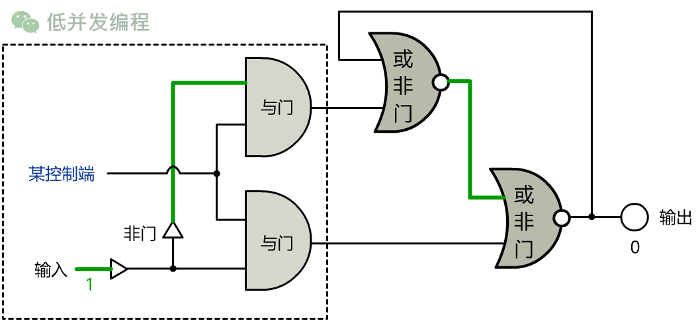

## 2. CPU 是个啥

什么是进程？
1、程序并不能单独运行，只有将程序装载到内存中，系统为它分配资源才能运行，而这种执行的程序就称之为进程。
2、程序和进程的区别就在于：程序是指令的集合，它是进程运行的静态描述文本；进程是程序的一次执行活动，属于动态概念。
3、在多道编程中，我们允许多个程序同时加载到内存中，在操作系统的调度下，可以实现并发地执行。这是这样的设计，大大提高了 CPU 的利用率。
进程的出现让每个用户感觉到自己独享 CPU，因此，进程就是为了在 CPU 上实现多道编程而提出的。

有了进程为什么还要线程？
进程有很多优点，它提供了多道编程，让我们感觉我们每个人都拥有自己的 CPU 和其他资源，可以提高计算机的利用率。很多人就不理解了，既然进程这么优秀，
为什么还要线程呢？其实，仔细观察就会发现进程还是有很多缺陷的，主要体现在两点上：
<1>进程只能在一个时间干一件事，如果想同时干两件事或多件事，进程就无能为力了。
<2>进程在执行的过程中如果阻塞，例如等待输入，整个进程就会挂起，即使进程中有些工作不依赖于输入的数据，也将无法执行。

    例如，我们在使用qq聊天， qq做为一个独立进程如果同一时间只能干一件事，那他如何实现在同一时刻 即能监听键盘输入、又能监听其它人给你发的消息、
    同时还能把别人发的消息显示在屏幕上呢？你会说，操作系统不是有分时么？但我的亲，分时是指在不同进程间的分时呀， 即操作系统处理一会你的qq任务，
    又切换到word文档任务上了，每个cpu时间片分给你的qq程序时，你的qq还是只能同时干一件事呀。

    再直白一点， 一个操作系统就像是一个工厂，工厂里面有很多个生产车间，不同的车间生产不同的产品，每个车间就相当于一个进程，且你的工厂又穷，
    供电不足，同一时间只能给一个车间供电，为了能让所有车间都能同时生产，你的工厂的电工只能给不同的车间分时供电，但是轮到你的qq车间时，
    发现只有一个干活的工人，结果生产效率极低，为了解决这个问题，应该怎么办呢？。。。。没错，你肯定想到了，就是多加几个工人，让几个人工人并行工作，
    这每个工人，就是线程！

线程！ 1.线程是操作系统能够运算调度的最小单位，它被包含在进程之中，是进程中的实际运作单位。 2.一条线程指的是进程中一个单一顺序的控制流，一个进程中可以并发多个线程，每条线程并行执行不同的任务。

    简单的说白了，线程其实就是一堆指令集（一个个指令的集合就叫线程），运行所有的信息其实就是一系列的指令（参照汇编的mov ax bx等等等，实质就是指令）。
    若os想让CPU工作起来的至少需要一个线程。

    当创建了子线程时，子线程会和主线程并驾齐驱的去执行，没有先后，是抢占式的（抢占CPU资源：通过os调度抢占）
    按理说CPU只能一个一个的串行，但这却是看似同时执行。
    1.并行：
        真正意义上的两件事情在同时做
    2.并发：
        没有同时干两件事情，但看似像是在同时

    为什么并发却好似达到了并行的效果，这是因为sleep，sleep时并不占CPU的任何资源，此时CPU是可以解决其他的问题的，因而好似达到了并行的效果。

    能让CPU放弃工作的两个条件：
        1.轮询执行：
            正常来说抢占式的执行是比如：分时间片的轮询抢占之类的，CPU快速切换不同的线程执行以达到抢占式的效果。（就像是在读一本书，每次读一些，之后记录
            页码，这就是一个上下文的一个状态。早年只有单核CPU，而在只有单核时可以完成一边听音乐一边看电影。这就是多个任务同时交给CPU，CPU轮询执行）
            程序是指令的集合，其实执行了一百条字节码（固定的指令集）可能写一条就被解析成了一百条字节码，参考汇编。之后就切换（非常快），因此并发的在跑。

        2.IO阻塞：
            如socket的recv、accept、文件操作的read、time的sleep。这些都有一个等待的过程。此时程序好似卡住，这其实就是IO阻塞。程序执行时可能还没有到
            切换的时间（看到了sleep）就IO阻塞了。此时程序就执行其他的线程，若再阻塞就再切换，直到CPU停止（都sleep）。这就解释了之前的sleep代码。

    那么有没有一种可能是因为电脑是多核的，执行时用了不同的CPU
        有这种可能！这种情况下就是真正的并行了。下面来说说

    线程是不同于进程的：
        进程：
            一堆资源组织联系在一起（资源：比如多个线程）而进程是对这些资源进行管理的一个集合。可以有变量，可以有占的内存的多少。这些的一个整体称为进程。
            对于计算时的一个资源的整合。

        线程：
            线程是可以资源共享的而进程则是不可以的

        例如一个.py文件就是一个进程，但通常，没有使用多线程时，它就是一个只有主线程的进程。一个QQ就是一个进程，里面组织在一起有很多个功能，而360也是
        独立进程的，内部的线程是共享的和QQ则是对立独立的。像刚刚开了三个线程一起跑，整体则是一个进程。

        线程、进程谁执行的快：
            其实是一样的（这是一个陷阱题，打他一巴掌（*-*））。怎么看这都是一样的同一个东西，怎么分快慢。根本就是一个东西，无可比性。

    操作系统为什么不分给3个CPU来并行运行：
        无论几核都没有用。坑死人了的Cpython。

    执行计算任务开线程与不开线程的对比：
        python高版本优化做的太好了！若用以前的老版本，串行执行是远远快于并发执行（开辟子线程）的 。按理来说创建子线程为了最大化的利用CPU。可事实上
        还比串行慢了不少（再不济你俩一样也行啊）这是为啥。问题在于处理的函数不同。

        之前用的是sleep，有空闲资源未被利用因此甚至能效率提升一倍。而此时CPU没有IO阻塞，一直在被利用，并没有空闲时间。而开辟了子线程确多出
        了不少的时间片的轮询切换消耗。而执行几千万次运算做了大量的切换多出来不少切换时间

    IO密集型任务或函数：
        有IO阻塞的状态，如sleep等

    计算密集型任务或函数：
        几乎没有阻塞状态CPU一直处于高效率运算。然而计算密集型的就不开多线程了么。
        如果只有一个CPU，那么计算密集型的是的确没得治，（就一个CPU一直执行，那么没必要切换了耶）此时怎么办。
        单核解决不了开多核啊。你有两个计算密集的我有两个CPU呀，你用第一个我用第二个时间是不是又缩短了。这是完美的解决办法，又提高了很多效率在
        JAVA里面OK，能达到并行（而不是一个CPU并发的让两个多线程去跑）。

        而Python就特么只认一个CPU。是这意思，这就是Python的Bug一般的存在的GIL (Global Interpreter Lock)全局解释器锁。因为有这种神奇的东西存在
        我们没有办法解决计算密集型的多线程。也就是说只有一颗CPU，IO密集型的可以优化节省中间的时间。但只有一颗CPU计算密集型的怎么都没法处理。而大幅度
        切换还会导致时间更长（3.5是做优化了因此不一样，之前真是用了线程比不用线程慢一倍QAQ）。那么为啥不用多核呢。这就要说到----GIL了

    GIL：（全局解释器锁）
        完全利用多核，再合理不过的需求，不然要多核干嘛呀。但这不是Python的BUG（其他语言虽然也没有（'.'）），这是解释器上的一个BUG。

        解释器：
            例如Cpython、JPython、pypy等。但是这些解释器里面只有Cpython有这个问题，而Cpython又是全世界通用的，然而现在发现这个BUG了，之后
            以后没准pypy就成为主流了（pycharm是IDE（集成开发环境） 笑 就像JAVA的Eclipse，是提高开发效率的）settings--Project Interpreter
            这里才是解释器。就像JAVA编译成class一样，python也是像利用记事本工具写出来通过解释器来解释成机器语言的，2.7、3.5版本都是解释器版本

            Cpython解释器加了一把锁，这把锁就是GIL。影响：在同一时刻，只能有一个线程进入我的解释器
            .py--->Cpython(GIL)---->os ----多个CPU，因为有了这把锁，就只能有一个线程进来。开3个线程他们会竞争式的跑（通过Cpython加锁），
            而在跑进来却只有一个。这就造成了之前的效果，搞的CPU开起来好像只有一个。加了一把锁，让线程不能同时进入os分给CPU。

        为啥要有这把锁：
            历史问题，Python开发者（脑子转不过轴）他创建这门语言时（进行很多数据的操作）但在线程方面的操作有风险，风险的处理就是加锁。
            JAVA、C++等什么语言的都一样要加锁。而Gui叔简单粗暴的在解释器上加了锁。但这的确是最有效的方式，加了锁之后，以后在进行这种数据
            的操纵自己就不用加锁了（默认在解释器上加了）太粗暴了！！！似乎当时没有问题（因为当时开发的时候只是单核，谁也看不出来）而在开发
            语言层面上有了这把锁对他们而言是很轻松方便的。但对于咱们用这门语言开发的人没意义。一到了多核CPU就是用不上。

            JAVA是怎么玩的呢，它们自己搞，什么时候涉及到数据操作了自己加锁（把加锁的操作交给程序员自己了）因此Python解释器对于程序员开发来说
            如同BUG一般的存在。因此说白了，Python到目前为止可以说是就没有多线程。

        真正意义上的多线程：
            是让两个线程让俩CPU同时去执行。而Python没有，它解释器不让。怎么办。历史原因GIL是去不掉了，除非换门语言，上世纪90年代就有发现
            后想要去掉了，但没办法，开发语言的过程当中所有都是建立在依赖GIL的基础上，突然去掉这些年的努力白费，除非换门语言。好的Python到此结束！
            不学了(▼へ▼メ)。关键是多线程太重要了，以后开发会大量用到的问题，没有会公司让你用串行执行的。---无奈。然而也有两个途径。多线程没有
            但不有多进程吗。

        解释器不让多线程同时跑，但没说多进程不行。这时候把俩任务放到俩进程里去跑，多进程可以进入解释器（先不说开销）分给多个CPU来解决。
        这个解决方案也是后期加上去的，虽然不完美，但确是可行的。不完美是因为线程和进程毕竟是不一样的，线程可以互相数据共享，我在这里定义了一个
        字典大家都能用。而进程不行了，进程则彼此独立，若多任务是有关联的虽然实现了并发，但他们之间若要通信的话（同时操作某一个数据）则需要增加
        别的内容，比如队列、中间进程。（因此不必过度夸大这个问题，因为以后开发要么考虑不到，要么有很多的替代方案，不用杞人忧天）
        以后要学的很多，不可能只局限于Python

    解决方案：
    1.协程：（+多进程）
        协程又不抢占。线程是竞争式的。而协程则是商量着来干，本身是一个线程。你休息我来，我休息你来。可以完成并发效果。虽然也是一个CPU但是可以
        让它+多进程啊。在一个线程里面用协程，我再开多个进程去写这个协程就OK了呀。总之方案一堆，而在于学的好坏。
        其实协程还是处理的是IO密集型的，只不过比起多线程要好一些，其实以后的生产环境中IO密集型的是大量存在的（比如爬虫需要IO等），计算密集型的反而比较少。

    2...很多..python有开发社区，优化明显，效率不仅持平甚至都超过去了。其实Go也慢（一半靠吹出来的）其实最好的办法用C什么的其他语言替写混合式开发
        很常见（就一块用其他的来写）打不过他就加入他也是一种好选择

    结论：在python里：
            if 处理的任务是IO密集型的：
                多线程是提高效率的。协程更是。
            if 任务是计算密集型的：
                sorry，改C。（这是我认为最漂亮的解决方法）若不会C还有多进程啥的解决方案

    子进程：
        在一个程序中可以开辟子进程，而每一个进程之间又可以开辟多线程。在创建子进程时则是copy了整块主进程，所以说开进程要比开线程的消耗还要大。进程的
        开销是非常大的。比如你一个进程占而20M，重新创建一个子进程它也占用20M（完全copy并且相互独立，线程是可以相互影响操纵数据片段的并通信）进程想通
        信则要借助队列管道或者是中间的进程之类的。进程是有自己独立的地址空间的。主线程是可以影响子线程的，而主进程则一点也不能影响他的子进程。

    线程中的参数：
        join():
            说白了就是阻塞用的，谁调用join就阻塞自己以外其他的线程，要等到自己执行后。即卡线程，若在主线程里面卡子线程则卡完之后主线程才继续。

        setDaemon(True):
            守护线程，子线程守护主线程。主线程一旦结束，子线程就不玩了（停止工作）。注意守护线程要在start前面。
            守护的线程则程序执行时不用等，而没有守护的线程则要等到执行结束。即t2.setDaemon(True)时，t1执行完毕程序就停止（因为t2是守护线程不等）
            说白了就相当于告诉程序不用等我执行完才结束，有其他的结束了就行（自己掉队，不用等了，你们先走我随后就到(・ω<)）。
            说实话这不仅不是守护反而是抛弃线程QAQ（连接池：一旦有了错误，一边结束了，其他的不能再跑了，主线程出错，就一块结束了）

    通过类创建线程：（不再通过模块）
        原则上建议常用，能用类的话还是别用函数为好。
        类似JAVA，通过继承Thread类来复写构造函数，记住一定不能忘记初始化父类，和run方法。并用初始化来传参，通过实例化对象来创建线程，利用内部
        的start方法（通过某种模式调用了run）开启线程（实质上类似之前的target改成run方法）

    同步锁：（JAVA里面也有同步锁、互斥锁,数据库中也同样）
        假设现在有一个需求，把一个数从100减到0，而函数功能则是每次减一，正常来说减100次则可以。但如果开辟100个线程按理来说可以瞬间减完。

        而在执行run方法时，CPU若在中途进行切换，则下一个进程取到的num则是上次一没有减完的，因此结果可能会导致多次同时减了一个num而出现
        没有减完的情况。（好在num -= 1的时间不够CPU达到执行切换时间片的时间，全局变量及时的被修改了，因此看似没有问题）只有当执行赋值的
        动作时进行CPU的切换才会导致结果的不正确。若不进行temp拆分则效果永远显现不出来。

        线程共享数据池：（即GIL vs thread Lock原理）
            count = 100  1.首先第一个线程拿到公共数据（准备进去了）---->2.申请到了gil lock--->2.5进入了python解释器----->3调系统的原生线
            程（这些都是C写的Python被没有写任何线程调用）---->4.在CPU上执行（做减一动作）但是它时间太长没有做完----->5.执行时间到了，要求被
            释放gil（直接进行切换到了下一个进程）----->5.5Python解释器（等待下一线程）--->6.下一个线程拿到公共数据（此时count还是100）---->
            7.下一个线程申请到了gil---->7.5进入了python解释器---->8.调系统的原生线程---->9.在CPU上执行--->10.完成了减一的操作----->11.赋值
            count = 99，并释放gil lock---->12.（进程1）重复之前第一次执行的所有过程---->13.执行完count - 1 的操作，把count重新赋值给了count。

        用join会把整个线程停住(参加代码注释部分)，造成了串行，失去了多线程的意义，而我们只用把涉及到操作公共数据的时候串行执行即可。
        也就是说通过同步锁来解决这种问题（无论JAVA、C++等任何语言都是如此）

        加锁就是告诉CPU我正在用，别的线程谁也不要进来了，除非我执行完了带锁的这一段，不然不执行完不释放。（只是这一段有改成串行，剩余的依然并发）
        r = threading.Lock()#创建锁
        r.acquire()#获得锁JAVA记得对应的是lock()
        r.release()#释放锁JAVA对应则是unlock()

    GIL已经加了一把锁了，为什么自己还要加锁：
        因为各有各的功能，GIL功能：对于解释器来说一次只能有一个线程进入解释器。锁的功能：则是CPU轮询时没解锁就不切换，防止冲突（把一部分带代码锁
            住串行执行）

    线程死锁和递归锁：
        死锁：（经典死锁）
            当两个线程的两个函数里同时有两把锁时，当第一个线程释放完后（此时CPU轮询第二个线程也开始获取锁）而第一个线程获取了锁B，休眠准备获取锁A
            第二个线程获取锁A，休眠，准备获取锁B，此时要获取的锁都在对方手里，各自不释放，此时程序不再工作，因而造成死锁状态。
            死锁状态应该避免，不能让其发生。

        递归锁：
            解决办法 利用lock = threading.RLock(),此时A、B锁全部替换为递归锁，程序达到理想效果。递归锁其实就是一个计时器一把锁。这把锁的不同之处
            即是可以多次acquire，内部一个计时器，每次acquire都会递加一个数，release的时候再对计时器做一个递减。（除了内部可以多次acquire和release
            之外，就是一把带计时器的锁，没错内部有一个对计时器的判断）当第一个线程的计时器不为零时（假设），第二个线程是不会进来的，锁里面有锁，一层层套。

            内部就像一个大字典，有多个键值对。一把锁对应一把钥匙，像这样来做的，因此上、解锁都是有对应的（唯一acquire对应唯一release）虽然写时看不
            出来，但是实际上是不同的

        死锁在生产环境中是会发生的，比如两个账户相互转账的同时，有其他函数对数据进行操作（此时通常来说应该在类中对公共数据操作部分加锁，而操作不止一
        次，因而极有可能会有死锁的发生，即带锁数据未解锁时引用了其他的带锁数据函数等）

# 进程：（ multiprocessing ）

    学习了线程再来看进程就很容易了，因为很多方法共用了一套编写方式
    进程的写法与线程几乎一致，但命名不能用multiprocessing.py(不能与模块重名)

    开启进程的开销巨大，它就相当于直接复制了一份一模一样的进程来运行。好处在于可以不被GIL锁控制，每个进程由于GIL锁的影响只能出去一个线程，此时则
    可以出去多个线程。此时则是并行的。

    由于GIL的存在，python中的多线程其实并不是真正的多线程，如果想要充分地使用多核CPU的资源，在python中大部分情况需要使用多进程。Python提
    供了非常好用的多进程包multiprocessing，只需要定义一个函数，Python会完成其他所有事情。借助这个包，可以轻松完成从单进程到并发执行的
    转换。multiprocessing支持子进程、通信和共享数据、执行不同形式的同步，提供了Process、Queue、Pipe、Lock等组件。

    multiprocessing包是Python中的多进程管理包。与threading.Thread类似，它可以利用multiprocessing.Process对象来创建一个进程。该进程
    可以运行在Python程序内部编写的函数。该Process对象与Thread对象的用法相同，也有start(), run(), join()的方法。此外multiprocessing包
    中也有Lock/Event/Semaphore/Condition类 (这些对象可以像多线程那样，通过参数传递给各个进程)，用以同步进程，其用法与threading包中的同
    名类一致。所以，multiprocessing的很大一部份与threading使用同一套API，只不过换到了多进程的情境。

    但在使用这些共享API的时候，我们要注意以下几点:

        1.在UNIX平台上，当某个进程终结之后，该进程需要被其父进程调用wait，否则进程成为僵尸进程(Zombie)。所以，有必要对每个Process对象
            调用join()方法 (实际上等同于wait)。对于多线程来说，由于只有一个进程，所以不存在此必要性。

        2.multiprocessing提供了threading包中没有的IPC(比如Pipe和Queue)，效率上更高。应优先考虑Pipe和Queue，避免使用Lock/Event/Semaphore
            /Condition等同步方式 (因为它们占据的不是用户进程的资源)。

        3.多进程应该避免共享资源。在多线程中，我们可以比较容易地共享资源，比如使用全局变量或者传递参数。在多进程情况下，由于每个进程有自己
            独立的内存空间，以上方法并不合适。此时我们可以通过共享内存和Manager的方法来共享资源。但这样做提高了程序的复杂度，并因为同步的需要而
            降低了程序的效率。

    Process.PID中保存有PID，如果进程还没有start()，则PID为None。

    window系统下，需要注意的是要想启动一个子进程，必须加上那句if __name__ == "main"，进程相关的要写在这句下面。

    若要设置为守护进行则不是调用方法，而是直接改数据daemon=True即可。terminate()不管任务是否完成，立即停止工作进程

    父子进程的关系：
        os模块的pid可以查看：
            os.getpid():查看子进程的proces id
            os.getppid():查看父进程的parent process id
        此时出现两个进程，子进程即是.py文件的主进程,而父进程则是pycharm的进程,进程方法名(__name__)为__main__若此时在开辟进程，则父进程
        是.py的主进程，刚刚开辟的进程为子进程,并且进程方法名：(__name__)为__mp_main__

        因此主进程和子进程有一个创建的递归排序（也就是 谁是谁的主进程）

    进程间的通信：（消耗大，通信复杂）
        不同进程间的的内存是不共享的,要想实现两个进程间的数据交换可以用Queue和Pipe两种方式：
            Queue：（进程队列）
                这个队列是用于进程中的，在进程multiprocessing下。和线程队列没有任何相同之处。使用方法跟threading里的queue类似此队列也
                有get和put方法，然而在传递时：
                q = multiprocessing.Queue()
                p = multiprocessing.Process(target=Foo,args=(q,))
                此时传递后在windows下是copy的一份队列，但是由于模块中的一系列封装，q可以在主进程和子进程中put和get队列中的数值
                而在linux下不得而知，大概也许没有copy（这里即下不做讨论）

            Pipe：（进程管道）
                利用创建管道的方式让两个进程之间进行通信：（其类似socket，但也略有不同）
                parent_conn ,child_conn = multiprocess.Pipe()
                p = multiprocessing.Process(target= Foo,args =(child_conn,))
                之后子进程和主进程之间可以利用send和recv进行通信，此时recv无参，不用指定数据的长度，send也无需转为bytes类型
                注意的是，主进程每次和子进程通信都要一一对应，每次send对应recv

    进程间的数据共享：
        利用Manger()来数据共享，通过Manger来创建对应的数据类型，在各个进程之间进行数据共享
        manger = multiprocess.Manger()
        dict = manger.dict()
        list = manger.list(range(10))
        p = multiprocess.Process(target= Foo,args=(dict,list))
        之后即可在主进程或子进程中共享这种创建好的数据

    注意其他的都与线程类似，体现在进程也都有 同步、锁、信号量、进程池等各种操作（进程池和线程池以后在做讨论）
